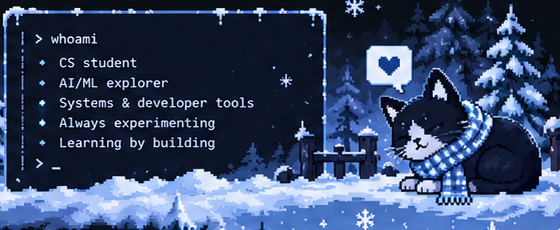

  

<table>
  <tr>
    <td width="55%" valign="top">
      <h1>Hey, I'm NotUrNio 👋</h1>
      <h3>CS • AI/ML • Developer Tools • Systems</h3>
      <blockquote><em>"Build it. Understand it. Improve it."</em></blockquote>
      

        I'm a computer science student exploring practical AI/ML and systems engineering.
        I like building tools, experimenting with local LLMs, and working on self-hosted systems.
        Curious by default. Learning by making.
      

    </td>
    <td width="45%" valign="top" align="center">
      
    </td>
  </tr>
</table>

---

### ❄️ Tech Stack

  
  
  
  
  
  

  
  
  
  
  
  

---

### 📁 Featured Project

<table>
  <tr>
    <td width="35%" align="center" valign="middle">
      
    </td>
    <td width="65%" valign="middle">
      <h3><a href="https://github.com/NotUrNio/ULPF">ULPF — Universal Log Processing Framework</a></h3>
      
A Python project for turning logs from different systems into consistent, traceable events with a local dashboard.

      

        
        
        
        
      

    </td>
  </tr>
</table>

---

<table>
  <tr>
    <td width="50%" align="center" valign="top">
      
<b>❄️ GitHub Activity</b>

      
    </td>
    <td width="50%" align="center" valign="top">
      
<b>&lt;/&gt; Most Used Languages</b>

      
    </td>
  </tr>
</table>

  Small experiments count. Consistent learning counts more.

---

  <b>Make it work → understand why → make it better.</b> 
  <a href="https://github.com/NotUrNio">GitHub</a> · <a href="https://github.com/NotUrNio/ULPF">Featured Project</a>

